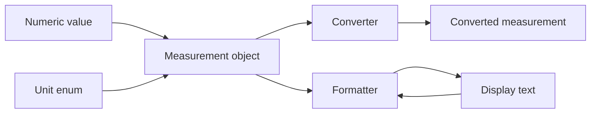

# irurueta-units

📏 **Irurueta Units** is a small Java library for representing, converting, formatting, and parsing physical measurement units.

It provides typed measurement objects such as `Distance`, `Speed`, `Temperature`, `Time`, `Volume`, and `Weight`, plus matching unit enums, converter utilities, and locale-aware formatters.

[](https://github.com/albertoirurueta/irurueta-units/actions/workflows/master.yml)
[](https://github.com/albertoirurueta/irurueta-units/actions/workflows/develop.yml)

[](https://sonarcloud.io/project/overview?id=albertoirurueta_irurueta-units)
[](https://sonarcloud.io/project/overview?id=albertoirurueta_irurueta-units)
[](https://sonarcloud.io/project/overview?id=albertoirurueta_irurueta-units)
[](https://sonarcloud.io/project/overview?id=albertoirurueta_irurueta-units)
[](https://sonarcloud.io/project/overview?id=albertoirurueta_irurueta-units)
[](https://sonarcloud.io/project/overview?id=albertoirurueta_irurueta-units)
[](https://sonarcloud.io/project/overview?id=albertoirurueta_irurueta-units)
[](https://sonarcloud.io/project/overview?id=albertoirurueta_irurueta-units)
[](https://sonarcloud.io/project/overview?id=albertoirurueta_irurueta-units)
[](https://sonarcloud.io/project/overview?id=albertoirurueta_irurueta-units)
[](https://sonarcloud.io/project/overview?id=albertoirurueta_irurueta-units)

## ✨ Features

- Typed measurement classes that keep a numeric value together with its unit.
- Unit enums for distance, surface, volume, speed, acceleration, angle, angular speed, angular acceleration, time, frequency, temperature, weight, and magnetic flux density.
- Static converter utilities for raw numeric values and measurement objects.
- Locale-aware formatters and parsers backed by Java `NumberFormat`.
- Metric and imperial unit-system helpers where the distinction applies.
- No runtime third-party dependencies.



## 🚦 Project status

- Current development version: `1.4.0-SNAPSHOT`
- Java target: Java 21
- Build system: Maven
- License: Apache License 2.0
- Quality checks: GitHub Actions, JaCoCo, Surefire, SpotBugs, and SonarCloud

## 📚 Documentation

- [Project documentation](https://albertoirurueta.github.io/irurueta-units/)
- [Javadoc report](https://albertoirurueta.github.io/irurueta-units/mvn-site/apidocs/index.html)
- [SonarCloud dashboard](https://sonarcloud.io/project/overview?id=albertoirurueta_irurueta-units)
- [Maven Site](https://albertoirurueta.github.io/irurueta-units/mvn-site)

The Antora documentation source lives in [`docs/modules/ROOT`](docs/modules/ROOT).

## 📦 Installation

### Maven

For a released dependency, pin the version you want to use. Example:

```xml
<dependency>
    <groupId>com.irurueta</groupId>
    <artifactId>irurueta-units</artifactId>
    <version>1.4.0</version>
</dependency>
```

For local development against the current repository snapshot:

```xml
<dependency>
    <groupId>com.irurueta</groupId>
    <artifactId>irurueta-units</artifactId>
    <version>1.5.0-SNAPSHOT</version>
</dependency>
```

### Gradle

```kotlin
dependencies {
    implementation("com.irurueta:irurueta-units:1.3.2")
}
```

## 🚀 Quick examples

### Convert values

```java
import com.irurueta.units.DistanceConverter;
import com.irurueta.units.DistanceUnit;
import com.irurueta.units.TemperatureConverter;
import com.irurueta.units.TemperatureUnit;

double kilometers = DistanceConverter.convert(
        1.0,
        DistanceUnit.MILE,
        DistanceUnit.KILOMETER);

double fahrenheit = TemperatureConverter.convert(
        20.0,
        TemperatureUnit.CELSIUS,
        TemperatureUnit.FAHRENHEIT);
```

### Work with measurement objects

```java
import com.irurueta.units.Distance;
import com.irurueta.units.DistanceConverter;
import com.irurueta.units.DistanceUnit;

Distance route = new Distance(5.0, DistanceUnit.KILOMETER);
Distance miles = DistanceConverter.convertAndReturnNew(route, DistanceUnit.MILE);

Distance extra = new Distance(350.0, DistanceUnit.METER);
Distance total = route.addAndReturnNew(extra, DistanceUnit.METER);
```

### Format and parse measurements

```java
import com.irurueta.units.Distance;
import com.irurueta.units.DistanceFormatter;
import com.irurueta.units.DistanceUnit;
import com.irurueta.units.UnitSystem;

import java.util.Locale;

DistanceFormatter formatter = new DistanceFormatter(Locale.US);
formatter.setMaximumFractionDigits(2);

String display = formatter.formatAndConvert(
        new Distance(1500.0, DistanceUnit.METER),
        UnitSystem.IMPERIAL);

Distance parsed = formatter.parse("12.5 ft");
```

## 🛠️ Build from source

Clone the repository and run Maven:

```bash
git clone https://github.com/albertoirurueta/irurueta-units.git
cd irurueta-units
mvn test
```

Useful commands:

```bash
mvn test          # run unit tests
mvn package       # build the JAR and generate JaCoCo coverage
mvn site          # generate Maven site reports
```

To build the Antora documentation locally:

```bash
cd docs
npx antora antora-playbook.yml
```

## 🧭 Supported measurement families

| Measurement | Examples of units |
| --- | --- |
| `Distance` | `METER`, `KILOMETER`, `INCH`, `FOOT`, `MILE` |
| `Surface` | `SQUARE_METER`, `HECTARE`, `ACRE` |
| `Volume` | `LITER`, `CUBIC_METER`, `GALLON`, `BARREL` |
| `Speed` | `METERS_PER_SECOND`, `KILOMETERS_PER_HOUR`, `MILES_PER_HOUR` |
| `Acceleration` | `METERS_PER_SQUARED_SECOND`, `G`, `FEET_PER_SQUARED_SECOND` |
| `Temperature` | `CELSIUS`, `FAHRENHEIT`, `KELVIN` |
| `Weight` | `GRAM`, `KILOGRAM`, `POUND`, `OUNCE`, `TONNE` |
| `Time` | `SECOND`, `MINUTE`, `HOUR`, `DAY`, `YEAR` |
| `Frequency` | `HERTZ`, `KILOHERTZ`, `MEGAHERTZ`, `GIGAHERTZ` |
| `Angle` and angular motion | `RADIANS`, `RADIANS_PER_SECOND`, `RADIANS_PER_SQUARED_SECOND` |
| `MagneticFluxDensity` | `NANOTESLA`, `MICROTESLA`, `MILLITESLA`, `TESLA` |

## 🤝 Contributing

Issues and pull requests are welcome.
Before submitting a change, run:

```bash
mvn test
```

For changes affecting documentation, also run:

```bash
cd docs
npx antora antora-playbook.yml
```

## 📄 License

This project is licensed under the [Apache License 2.0](https://www.apache.org/licenses/LICENSE-2.0).
